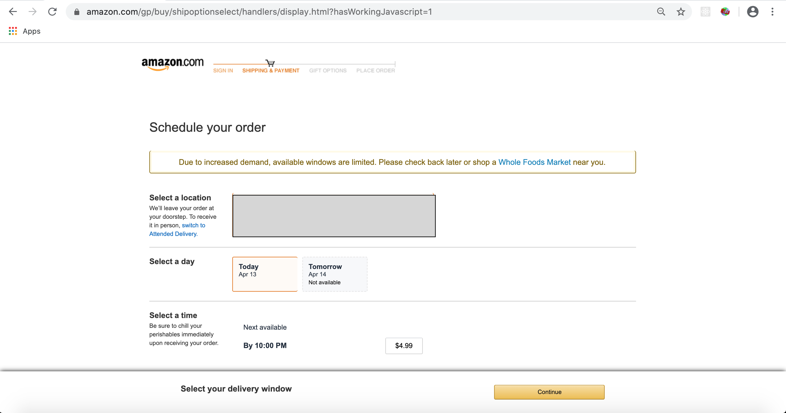

# Amazon-Whole-Foods-Delivery-Slots-Finder
A simple Google Chrome extension that polls for Whole Foods delivery slots on Amazon and alerts the user when a slot is found.

# How do I install it?
Search for the extension in the Chrome Web Store or click [here](https://chrome.google.com/webstore/detail/amazon-whole-foods-delive/dbppijhmnaanngcbfhejflfbdecfbjfh)

If you want to play around with code and develop on it, download the code from this repo and follow the instructions for **Developer Mode** from Chrome Web Store.

**Compatibility** 
- Google Chrome on Mac, Windows 
- Only works for Whole Foods ordered through www.amazon.com

# How does it work?
- The script in the extension can be kicked off by clicking on the extension icon while on the the Whole Foods 
- The script reads the webpage and tries to find delivery slots using keywords like "AM", "PM", etc. 
- Alerts the user if a delivery slot is found. *Note: The alert can be toggled off by clicking the extension icon.* 
- Tries to navigate back to the *Schedule Your Order* page if it ends up on an unknown page somehow. 

**Disclaimer** 
- This extension does not guarantee that delivery slots will be found. 
- This extension is not an automated checkout system. It will fire an alert if a slot is found and stop. 

# Credits
- Icons (chatbots - 16x, 24x, 32x, 64x, 128x) are taken from [Flaticon](www.flaticon.com)
- Sounds/note.mp3 is taken from [Mediafire](http://www.mediafire.com/file/8atcqfqzptlblc5/extension-27496465.zip/file)
